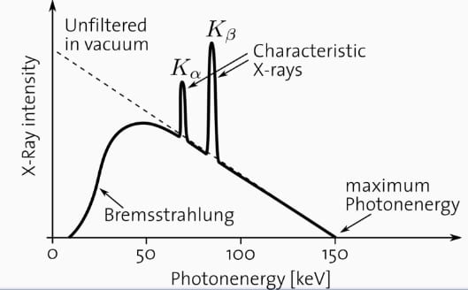
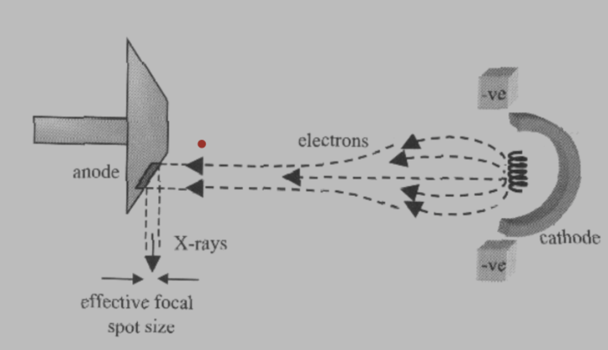

# ZSL
> - optická, fluorescenční a elektronová mikroskopie, principy a použití
> - rentgen - principy, zdroje a detektory, počítačová tomografie (CT) - principy, konstrukce, a rekonstrukční techniky
> - ultrazvuk - principy, generování, detekce, Dopplerovský ultrazvuk, kontrastní látky, 3D
> - magnetická rezonance (MRI) - fyzikální principy, prostorové kódování, funkční magnetická rezonance (fMRI)
> - nukleární zobrazovací metody - SPECT, PET, principy, rekonstrukční algoritmy a použití

# Microscopy :microscope:
- **Optics basics**
	- **Reflection**
		- the angle at which a ray bounces away is the same as the angle at which the ray impacted the object
	- **Refraction / snells law**
		- $$\frac{\sin\theta_1}{\sin\theta_2}=\frac{n_2}{n_1}=\frac{c_1}{c_2}$$
	- **Diffraction**
		- Huygens princip 
			- princip kulovych vln, each point is a source of spherical wave, which give us a plane wave when combined
		- position of maxima 
      $$d\cdot\sin\theta=m\lambda, \quad m\in\mathbb{Z}$$
	- **Point spread function**
		- Airy discs are the impluse response of a PSF, results of diffraction, ideally as small as possible
		- ![[Pasted image 20230524195338.png|200]]
- **Microscopy basics**
	- ![[Pasted image 20230524192508.png|400]]
	- ![[Pasted image 20230528225732.png|400]]
	- **Thin lens equation**
		- $$\frac1a+\frac1b=\frac1f$$
	- **Eyepiece magnification**
		- $$Z_{eyepiece}=\frac{25 cm}{f_{eyepiece}}$$
	- **Objective magnification**
		- $$Z_{obj}=\frac{b}{a}$$
- **Infinity corrected microscopy raypaths**
	- **Magnification**
		- $$Z_{inf}=\frac{f_{tb}}{f_{ob}}$$
<!-- - **Microscopy construction** -->
<!-- 	-  -->
- **Resolution - rayleigh equation**
	- $$d\approx1.22\frac\lambda{2NA}$$
	- where $NA=n\sin(\theta)$ is numerical appereture, it is big for big lenses
	- $n$ is refractive index (index lomu)
	- $\lambda$ is wavelength
- **Microscopy enhancements**
	- **3D microscopy**
		- **Confocal microscopy**
			- ![[Pasted image 20230528182956.png|400]]
			- suppress signal from other depths than the focal plane, only images from the focal plane passes through the aperature
		- **OCT (opticka koherencni tomografie)**
	- **Fluorescence / two-photon microscopy**
		- shine a light (UV typically) on a fluorescent agent and it emits a visible light
		- it can be bound to specific structures in a cell for example
		- or we can also cause fluorescence by two lower-energy photons which go in succession 
	- **Phase contrast**
		- enhance the contrast of transparent or low-contrast specimens by converting differences in refractive index into differences in brightness, allowing for detailed visualization of cellular structures and processes without the need for staining or labeling
		- we insert a phase ring below the specimen and another compensating phase ring above the specimen to compensate the changes
	- **Dark field**
		- an optical technique that enhances contrast and visibility of unstained or transparent specimens by blocking the direct light and illuminating the specimen against a dark background using oblique or angled light rays
	- **Superresolution**
		- **Simulated emission depletion**
			- resolution 2~80 nm
			- ![[Pasted image 20230528183535.png]]
			- shine with a light (excitation), shine with a light which has a hole inside (de-excitation), the remaining area will emit fluorescence which can be smaller than the wavelength of light
		- **Stochastic optical reconstruction microscopy (STORM/PALM)**
			- spontaneous fluorescence
		- **Scanning electron microscopy (SEM)**
# X-ray 🩻
- **Spectrum**
	- x-ray wavelenght is $10\:nm$ to $1\:pm$
	- energy is equal to frequency and planck constant
    $$E=hf$$
	- where the frequency can be computed from the wavelength and the speed of light
    $$c=f\lambda \approx 3\cdot10^8 m/s$$
	- an electronvolt is defined as 
    $$1\:eV=1.6\cdot 10^{-19}J$$
	- radiation is ionizing above 10 eV
	- the spectrum goes to zero (stopped electrons), except the radiation lines which correspond to the anode material (x-ray tube material)
	- low energy rays are filtered (with an aluminium filter), these would not penetrate the patient, only heat him up, increase the radiation dose and create more noise in the image
	- the procedure of removing low energy photons and increasing the average energy of the photons is called beam hardening (vytvrzovani svazku)
  - 
- **Construction**
	- kolimator / collimator
		- clona, ozarovani pouze toho co chceme videt
	- antiscatter grid
		- lets trough only primary X-rays and attenuate those from compton scattering
- **Generation**
	- rentgenka
		- a glass tube with vacuum and a wire (kathode)
		- and an induction rotor, it rotates so it doesnt melt (anode)
		- there is high voltage between the kathode and anode (15-150 kV)
		- when the electrons from kathoide hit the anode they are stopped, which produces heat and el. mag. radiation
    - 
- **Detection**
	- film with luminophor layer formed of big atoms $\implies$ bigger chance a photon will hit them
	- today mostly digital sensors
		- computed radigraphy: laser scanning of a reusable film
		- flat-panel detectors from semiconductors
		- thin-film transistor array
		- charge coupled devices

## Computed tomography
- we measure projections from several angles to obtain a 3D picture
- **Attenuation**
	- occurs exponentialy in tissue: 
    $$I=I_{0}\exp \left({-\int \mu (x,y)\,ds}\right)$$
	- so attenuation $p$ can be expressed as: 
    $$p_{\theta}(r)=\ln\frac{I}{I_0}=-\int_L\mu(x)\:dl$$
- **Fourier slice theorem**
	- a fourier transfrom of an projection of a 2D object taken at an angle $\theta$ is the same as a line at an angle $\theta$ going through the 2D fourier transformation of the object
	- so we can build the fourier space by taking different projections at angle $\theta$ and compose the fourier space out of them line by line and then get the 2D object by taking a inverse fourier transform of the spectrum
- **Forward radon transform** 
  $$
  \begin{align}
  p(\hat x,\theta) = \int f_o(x,y)\:d\hat y
  \end{align}
  $$
	- this is a single projection
	- if we take projections at varying angle $\theta$ and place them into a matrix we get a sinogram
- **Reconstruction**
	- **Naive backprojection**
		- take the projections and project & sum them back at the corresponding angles
          $$\sum_\theta J(\theta,x\cos\theta+y\sin\theta)$$
          where $J$ are the projections
		- this is only approximate reconstruction of the image and it will contain a large amount of artifacts
	- **Filtered backprojection**
		- a way to approximate the inverse radon transform, this is needed because we only have sparse samples in the fourier domain
		- $$S_{\theta}=\int_{-\infty}^{\infty}J_{\theta}(p)e^{-j\cdot2\pi\omega p}$$
		- where, $p = [\theta,x\cos\theta+y\sin\theta]$
		- then we can reconstruct the image as
          $$f(x,y)=\int_{0}^{\pi}J_{\theta}^*(p)\:d\theta,$$
          where $J_{\theta}^*(p)$ is the filtered inverse of $S_{\theta}$, so 
      $$\begin{align} J_{\theta}^*(p)=\int_{-\infty}^{\infty}|\omega|S_{\theta}e^{j\cdot2\pi\omega p}=\mathcal{F}^{-1}\{|\omega|\cdot\mathcal{F}\{J_{\theta}(p)\}\}=\mathcal{F}^{-1}\{|\omega|\}*J_\theta(p) \end{align}$$
		- so the great result is that we need to filter the backprojection by a ramp filter (absolute value), the real thing is called ram-lak, there exist other filters, they are based around modifying the absolute value filter so it provides better results
		- FBP assumes parallel geometry, in reality the beam geometry will be a fan
	- **Algebraic reconstruction**
		-  we want to construct a system of equation that will allow us to compute the image function $f$ from the projection $g$ and weights for each pixel $w$ from the image we are trying to recover
      $$g_i=\sum_jw_{ij}f_j$$
		- we can encode some statistical assumptions into the weights
		- algebraic reconstruction is better suited to modelling noise factors such as beam hardening, difraction fan beam geometry apod.
		- Two basic types
			- additive
				- add a value to the ray path to minimize the error
			- multiplicative
				- multiply the values along the ray-path to minimize an error it
		- It is more precise, albeit more computationally  expensive than FBP
	- **Fan beam reconstruction**
		- rebinning
			- prerozdelime paprsky tak aby vysledek byly paralelni obrazky
	- **3D CT**
		- **helix / slice by slice / rez po rezu**
			- stara
			- rentgenka jednou obehne a posune se pacient
			- nic moc
		- **spiral**
			- nova
			- rentgenka zaroven obiha a zaroven se posouva pacient, vysledek je spirala
			- **parametr pitch**
				- $P=\frac{\triangle l}{d}$, kde $d$ je sirka rezu a $\triangle l$ je posun luzka za jednu rotaci
				- Typicky 1.5
	- **Clinical applications**
		- lungs
		- head
		- stomach organs (often with contrast agent)

# Ultrasound 🔊
- **Propagation**
	- 2-50 MHz
	- max pulses er second 3750
	- wavelength 
    $$\lambda = \frac{c}{f}$$
	- **speed**
		- $1500\:\frac{m}{s}$ in water, human body is mostly water
		- propagation of acoustic waves in matter
      $$c=\frac{1}{\sqrt{\rho K}}$$
      - where $K$ is compressibility, e.g. $1/E$ (youngs module of elasticity)
      - $\rho$ is density
- **Reflection**
	- intensity reflection coefficient on a boundary for a perpendicular ray 
    $$R=\frac{Z_1-Z_2}{Z_1+Z_2}$$
- **Refraction**
	- snells law 
      $$\frac{\sin\theta_2}{\sin\theta_1}=\frac{c_2}{c_1}=\frac{v_2}{v_1}$$
		- where $v$ is refractive index (index lomu)
		- $c$ is speed in each material
- **Attenuation**
	- $$I=I_{0}e^{-2\alpha x}$$
		- where $\alpha \propto f$
		- attenuation is proportional to frequency (unlike in el.mag. radiation techniques)
	- half-value layer (polotloustka) is a distance before the energy is halved
	- caused by
		- divergence on the wavefront (rozbihani svazku)
		- absorption
		- reflections
- **Scattering**
	- scattering reflection caused by small inhomogenities which scatter the rays into all directions
		- causes salt&pepper noise in the image
- **Impedance**
	- acoustic imedance
      $$Z_t=\frac{p (\text{ pressure})}{I\text{ (flow)}}=\rho_0 c$$
		- unit is $\frac{kg}{s\cdot m^2}=1\:Rayl$
		- impedance is low in water, higher for bones
- **Generation & detection**
	- ultrasound impulses, energy $10-100\:mW/cm^2$
	- short impulses $2\:\mu s$
	- piezoelectirc elements are used both for generation and detection
		- they generate pressure when electrical energy is applied (generation)
		- and they generate electrical energy when pressure is applied (detection)
	- each element has a dampening layer behind it so we do not get artefacts from the waves bouncing around the probes
	- **Ultrasound field**
		- close field - fresnel region (complicated reconstruction, $5\:mm-1\:cm$)
		- far field - fraunhofer region (gaussian profile of the wave intensity)
		- $L=\frac{D^2-\lambda^2}{4\lambda}$, how far is the focus from the probe, focus is the border between the two regions
- **Image processing**
	- the probe detects high frequency signal ~ mHZ, this can be processed directly or we can demodulate it (construct an envelope) and process the demodulated envelope which is ~ kHZ
	- at each point in the image we send out a signal, wait and detect echoes which come back
	- image is reconstructed from echoes which come back, there can be multiple echoes if the wave bounces a few times (reverberation)
	- amplifier
	- voltage controlled attenuator
		- normalise near and far echoes of different strengths
	- demodulation
- **Modes**
	- A-mode (amplitude)
		- ..
	- B-mode (brightness)
		- two dimensional image which shows the structure of the tissue
	- M-mode (motion)
		- choose one direction in B-mode and measure how it changes in time
- **Doppler principle**
	- waves are compressed in front of the source and stretched behind it
  $$f_r=f_s\left(1±\frac{v}{c}\right)$$
	- For two moving objects the equation is 
      $$f=\frac{c\pm v_r}{c\mp v_s}$$
		- where $v_r$ is the speed of the receiver and $v_s$ is the speed of the source
		- $f_{min}=\frac{c-v}{c+v}$ for a blood that moves away
		- $f_{max}=\frac{c+v}{c-v}$ for a blood that moves forward
	- Doppler frequency 
    $$f_D=\frac{v_s}{c}f_s$$
	- Dopplerovsky posun jsou ~desitky Hz
- **Doppler imaging**
- **Frequency shift measurement**
	- **Continuous wave doppler**
		- continuous sending and receiving
		- can't differentiate the depth
	- **Pulsed wave doppler**
		- pulse based sending and receiving, send a pulse of several impulses and receive it and determine the frequency shift
		- can differentiate depth
- **Demodulation of doppler signal**
	- kvadraturni demodulace
		- multiply the sent signal with the recieved signal (which will have slightly different frequency)
		- we get two signals $f_1+f_2$ and $f_1-f_2$
		- add low pass to filter the high frequency signal so we are left with the signal of $f_1-f_2$ which is the doppler shift
	- smerova demodulace
		- oscilator ktery da dva signaly posunute o 90º
		- posuneme prijaty signal o dalsich 90º
			- 0 -> kladny smer
			- 2$\times$ -> zaporny smer
- **Limits on the maximum speed**
- **Clinical applications**
	- cardiovascular imaging, the only technique capable of viewing heart in real time (spravne uzavirani chlopni)
	- intra-vascular ultrasound (put probe inside arteries to determine blockage)
	- vysetrovani plodu v tehotenstvi
- **Contrast agents**
	- microbubbles
		- small air bubbles, ultrasound bounces a lot from air, enhances blood contrast
- **Harmonic imaging**
	- transmit $f_0$, receive $2f_0$
	- this reduces artefacts and improves resolution

# MRI 🧲

- **General principle**
	- each $H^+$ proton acts like a tiny magnet, there are other atoms we could use for this, but hydrogen is by far the most common one in human body
	- normally the orientation of the magnetization vector for each atom is random, however in a strong magnetic field they orient mostly in its direction, which forms a net magnetization vector
	- the stronger the field the stronger the effect
	- Spins are excited by a radio pulse, they emit signal while they are realigning it is different for different tissues so image can be reconstructed
	- MRI is very precise (mm resolution), but it is also quite expensive
- **Nuclear spin in magnetic field**
	- torque
    $$\tau=\mathbf{\mu} \times \mathbf{B}$$
- **Precession**
	- the atom is also spinning along the axis of the magnetization vector with frequency given by the larmor equation
  - **Larmor equation / larmor frequency**
    - $$f_0=\gamma B_0$$
    - where $f_0$ is the precession / spin frequency, $\gamma$ is gyromagnetic ratio (unique for each element) and $B_0$ is the strenght of the magnetic field
    - this frequency is also the received and excitation signal frequency
- **Excitation**
	- a radio frequency (RF) pulse is used to temporarily align the magnetization vectors into another plane, they will realign back in the original direction of the magnetic field and we can measure this realignment
	- the frequency of this pulse is given by the larmor equation
- **Flip angle**
	- how much is the net magnetization vector flipped, depends on the strength and duration of the RF pulse
	- usually this is 90$\degree$ or 180$\degree$
	- however it can be less if we want to use for example partial relaxation, if we do not wait for the entire time $T_1$ and only excite it for a partial angle  
- **Time constants**
	- these are different for each tissue, this allows us to differentiate between different tissues
	- **T1**
		- the time when 63 % of the original magnetization returned from the excitation
		- 90º pulse decay 
        $$M_z=M_0(1-e^{-\frac{t}{T_1}})$$
		- 180º pulse decay 
        $$M_z=M_0(1-2e^{-\frac{t}{T_1}})$$
		- spin-lattice relaxation time
    - on the order of seconds
	- **T2**
		- the time when 63 % of the excited magnetization direction has been lost
		- due to dephasing of protons which leads to differences in procession
		- caused by molecular interactions
		- traversal magnetization 
        $$M_{xy}=M_{xy0}e^{-\frac{t}{T_2}}$$
		- where $t$ is time and $T_2$ is spin-spin relaxation time
	- **T2**$^*$
		- inhomogeneous magnetic field is another cause for $\text T2$ relaxation and together with $\text T2$ they form the $\text T2^*$
		- $$\frac1{\text T2^*}=\frac1{\text T2}+\frac1{\text T2^{\text{inhom}}}$$
		- this is what we measure

## MRI excitation sequences
- **FID (Free induction decay)**
  - the start is the same as FID, we apply a 90º pulse and get a exponentially decaying sinus
  - the magnetization vector spirals back into the original orientation
  - this induces measurable electrical signal in the form a exponentially decaying sinusoid
  - signal strength
      $$S\propto\varrho(1-e^{-\frac{T_R}{T_1}})$$
  - where $S$ - signal amplitude, $\varrho$ - spin density, $T_R$ - repetition time
- **Spin echo**
  - used to measure T2 relaxation
  - the start is the same as FID, 
  - send a 90º pulse and get a exponentioally decaying sinusoid
  - the spins will get out of phase due to T2$^*$ effects
  - we apply a 180º refocusing pulse which makes the protons spin in the oposite direction, due to the difference in speeds being constant they will realing with each other eventually
  - the alignment of the vectors creates an echo which is used for the image
  - signal intensity (note that the first part is the same as in FID)
      $$S\propto\varrho(1-e^{-\frac{T_R}{T_1}})e^{-\frac{T_E}{T_2}}$$
  - we can send several of these 180º pulses to obtain multiple echos, though they will decay in amplitude as the magnetization vector returns to the original orientation, when the decay is large enough we have to restart the sequence by flipping it back with a 90$\degree$ RF pulse
  - **$T_E$ (Time to echo)**
    - time between 90º RF pulse and the echo
  - **$T_R$ (Time to repetition)**
    - time between 90º pulses (between each sequence restart)
- **inversion recovery**
  - used to measure T1 relaxation
  - send a 180º pulse which turns magnetization vector to -z
  - asend a 90º pulse, which causses precession in xy axis and causes FID signal to appear
  - signal intensity after one repetition 
      $$S\propto \varrho(1-2e^{-\frac{T_I}{T_1}})$$
  - signal intensity after multiple repetitions 
      $$S\propto \varrho(1-2e^{-\frac{T_I}{T_1}}+e^{-\frac{T_R}{T_1}})$$
  - where $\delta$ is the spin intensity and $T_I$ is the time between the pulses
  - we measure it for different $T_I$ to obtain $T_1$
- **gradient echo**
  -  fast, doesnt compensate $T_2$
  - the signal is created by the frequency encoding gradient
  - ernst angle - optimal flip angle

- **NMR Spectroscopy (nuclear magnetic resonance spectroscopy)**
	- we can perform fourier analysis on the received signal and from the spectrum determine which tissues / chemicals are present
	- magnetic field stabilization
		- decreases in time, apply field lock
	- homogenizace mag pole
		- correction coils
	- detection
		- receive RF signal that is around ~50 mHz, shift on a lower frequency similarly as in ultrasound
- **Spatial resolution**
	- gradient frekvencniho kodovani
	- the strength of the field is linearly increasing, so we can differentiate between different slices in the patient
- **Frequency and phase encoding** 
  $$f=\gamma(B_0+xG_x)$$
	- the frequency of the signal is linearly increasing along the x axis
	- the phase of the signal is changing across the y axis
		- we turn on the phase gradient coil for a short impulse which will displace the phase in the y direction
	- this allows us to determine from what position the signal came from
	- this is done using gradient coils 
- **Slice selection**
	- $f=\gamma(B_0+zG_z)$
	- activate the slice by activating a RF signal of the corresponding frequency
	- we want the frequency profile in the fourier domain to be rectangle (so it does not excite neighbouring slices)
		- this is the property of the $sinc\:x$ function
- **K-space**
	- 2D fourier transform space
	- in 1D we would have 1D sinusoids, in 2D we have 2D sinusoids whose orientation and amplitude depends on the position in the spectrum (k-space)
	- slower frequencies close to the origin carry contrast and most of the information
	- faster frequencies further from the origin give us detail
- **Fourier imaging and reconstruction**
	- reconstruction is done with backprojection, or iterative methods, which work better
	- **kvadraturni demodulace**
		- smichani signalu s ~larmorovou frekvenci a dostaneme signal ktery ma frekvenci nekolik kHz a lze ho lepe zpracovat
- **FOV (field of view)**
	- larger FOV, smaller resolution, thicker slices
	- trade-off between image resolution and spatial coverage
	- the imaged object must be smaller than
		- $FOV_x=\frac1{\triangle k_x}$, where $\triangle k_x=\gamma G_f t_{samp}$
		- $FOV_y=\frac1{\triangle k_y}$, where $\triangle k_y=\gamma G_{\phi} t_{\phi}$
		- otherwise we will get aliasing
- **Fast MRI**
	- **Multislice**
		- we use slices, $B$ isn't constant but decreases
		- then we can use different RF frequences to take images from different slices, so we don't have to wait for the spins to relax
	- **Fractional imaging**
- **Contrast**
	- **T1 weighting**
		- $T_2$ se neuplatni, signal nestihne klesnout
		- long TR : 2-5 s, $T_R\approx T_1$
		- long TE : 80-120 ms, $T_E << T_2$
	- **T2 weighting**
		- $T_1$ se neuplatni, signal klesne na nulu
		- Short TR : (450-700 ms), $T_R >> T_1$
		- Short TE : 20-30 ms, $T_E \approx T_2$
	- **PD (proton density)**
		- Long TR : 2-4 s, $T_R >> T_1$
		- Short TE : 20-30 ms, $T_E << T_2$

## MRI hardware
- **Construction**
  - **Open**
    - smaller
    - better localization
    - smaller $B (0.23-0.6\:T) \implies$ smaller resolution
  - **Closed**
    - better resolution
    - larger, patient needs to be placed inside
- **Superconductive magnets**
  - cooled by liquid helium in vacuum (fridge-like mechanism)
  - electromagnets allow higher intensity fields
- **Coils**
  - **Gradient coils**
    - frequency gradient
    - phase gradient
  - **RF coils**
    - zaroven vysila a prijima
- **Safety**
  - for the love of god do not bring anything magnetic inside

- **Chemical shift**
	- chemical bonds decrease the intensity of a magnetic field, this leads to the decrease in the resonance frequency
	- vyjadruje se jako ppm (parts per milion) $$d=\frac{n-n_{ref}}{n_{ref}}10^6$$
- **Contrast agents**
	- toxic metals: Gadolinium
	- noble gasses: Xe, He
	- typically injected
	- they influence $T_1$ and $T_2$, so we can better image things such as tumors
- **Angiography**
	- MRA utilizes magnetic fields and radio waves to create detailed images of blood vessels without the need for ionizing radiation or contrast agents.
	- It can provide 2D or 3D images of the blood vessels, offering information about their anatomy, flow dynamics, and the presence of any abnormalities or blockages.
	- MRA is frequently used for imaging blood vessels in the brain, neck, chest, abdomen, and extremities.
- **Flow imaging**
	- …
- **Diffusion MRI**
	- difusivity of water
- **Tagged MRI**
	- make marks which will deform as the tissue deforms
- **Spectroscopy**
	- …
- **Functional MRI**
	- can be used to determine the activations in the brain
	- regions working more use more blood and more oxygen, hemonglobin changes its magnetic properties based on whether it has an oxygen bound to it
	- **BOLD effect (fMRI)**
		- Blood oxygen level dependent
		- deoxyhemoglobin disturbes the magnetic field and slows down $T_2$ relaxation
		- excitacni sekvence je bud gradientni echo a nebo casteji se pouziva planarni zobrazovai
		- very low SNR (0.1), is averaged over many measurements
- **Hemodynamic response**
	- time-series of activity
	- neuron activity $\implies$ more blood & oxygen consumption $\implies$ BOLD signal
	- ![[Pasted image 20230525192338.png|200]]
	- ![[Pasted image 20230528130350.png|400]]
- **Statistics of fMRI**
	- **Linear model**
		- we have some pre-defined models on how the series should look like
		- we fit a linear model to the signal to determine which of the predefined activity it contains
		- this is done for each voxel
	- **Statistical testing**
		- t-test
			- we compute a p-value for each model and each model coefficient
	- **Corrections**
		- family-wise correction, bonferonni correction
		- $\alpha_{bonferonni}=\frac{\alpha}{\text{number of pixles}}$

# Nuclear imaging 🧬
- in nuclear imaging the source is inside the patient, this is called emissive imaging, we want to image metabolism, blood concentration (prokrveni)
- uses gamma radiation, often used to display tumours
- **Gamma camera**
	- 2D imaging
	- antiscatter grid ? (odmitnuti rozptylenych paprsku pod uhlem)
		- reduce salt & pepper noise, but increase blurring (get less photons)
	- fotomultiplikator (fotonasobicka)
	- luminofor (film for detection)
	- very low resolution
- **SPECT (single photon emission computed tomography)**
	- extension of gamma camera (similarly to x-ray $\rightarrow$ CT)
	- image is computed with backprojection, algebraic reconstruction
- **PET (positron emission tomography)**
	- use cyclotron to create proton-rich radionuclides which will decay and emit positrons
	- positron is emitted, annihilated with electron and emits two gamma rays into opposite direction of intensity 512 kEv
	- then if we detect the signal in two detectors which are directly opposite we can reconstruct the line where the annihilation happened
	- **usage**
		- turmors (metabolism)
		- brain
		- lungs
		- can target specific chemicals by creating a radioactively marked version of the chemical
- **Reconstruction methods**
	- 3D mode
		- each detector remembers the signals it recieved and the timestamps and then the image is reconstructed in postprocessing
	- 2D mode
		- each pair of detectors has some interval where it considers the rays they received as signal
- **Radioactivity**
	- in case there is too many, too little neutrons in an atom it will be unstable (reka stability)
- **Decay**
	- $\beta$ : $n\rightarrow p + \beta^-$, neutron decays into proton and an electron is emmited (so called negative beta decay, there is also a positive one, when positron is emitted instead)
	- $p\rightarrow n+\beta^+$
	- isomeric transition
		- change in energy state
	- decay equation:
		- $N(t)=N_0e^{-\lambda t}$
			-  where $\lambda$ is a k-life constant, $\lambda=\frac{\ln\:k}{t_k}$
			- or more often we use half-life constant
			- $\lambda=\frac{ln\:2}{T_{1/2}}$, where $T_{1/2}$ is the half-life
		- activity $A=N(t)\cdot\lambda \:[Bq]$
		- $A=\frac{dN}{dt}$
			- where $N$ is the current number of atoms
- **Radionuclide production**
	- neutron bombardment (bombardovani neutrony)
	- fission (products of fission of uranium for example)
	- bombard with a stream of protons (cyclotron)
- **Radionuclides / radiopharmaceuticals**
	- $^{99}Mo$, $\beta^-$, for SPECT
		- manufactured by neutron bombardment
	- $^{62}Zn$, $\beta^+$,  for PET
		- manufactured by proton bombardment (cyclotron)
	- $Tn$, for isomeric transition
		- Molybdenum $\rightarrow$ High energy technetium $\rightarrow$ lower energy technetium
	- $I$, iodine
	- $^{14}C, ^{11}C$
- **Cyclotron**
	- used to accelerate particles
	- we have electrons inside two electrordes which periodically swap charge, inside a magnetic field so their path is curved, if they accelerate to sufficient speed they will hit a carbon foil, where they convert to protons and fly away
- **Generator**
	- Molybdenum $\rightarrow$ High energy technetium $\rightarrow$ lower energy technetium
	- transient equilibrium $A_2=A_1\frac{\lambda_1}{\lambda_2-\lambda_1}$
## Radiation
- **absorbovana davka**
	- $D$, $1\:Gy\:(gray) = 1\:J/kg$
- **radiation dose, davkovy ekvivalent** 
  $$H_E=\sum_iw_ic_iD_i$$
  - CT dose ~ $10\:mSv$
- **Radiation absorbtion**
  - Hounsfield units (HU): 
    $$HU(t)=1000\frac{\mu_{tissue}-\mu_{water}}{\mu_{water}-\mu_{air}}\:[-]$$
  - relative attenuation wrt. water
  - ~0 water
  - very negative: air -> lungs
  - negative (-100) : fat
  - soft tissue +[0,100]
  - if > 500 => bone
- **Radiation limits**
	- pracovnici 20 mSv/rok po doby 5 let nebo 50 mSv/rok a klid 5 let
	- obyvatelstvo 1 mSv/rok po dobu 5 let nebo 5 mSv/rok a klid 5 let
